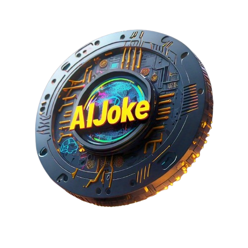

# AIJokeCoin 😂

  <!-- Logo added here -->

Welcome to **AIJokeCoin**, the cryptocurrency that brings humor to the blockchain! Our platform combines the fun of jokes with the innovative world of blockchain technology. 

## Table of Contents

- [AIJokeCoin 😂](#aijokecoin-)
  - [Table of Contents](#table-of-contents)
  - [Features](#features)
  - [Installation](#installation)
  - [Usage](#usage)
  - [Contributing](#contributing)
  - [License](#license)
  - [Contact](#contact)

## Features

- **AI-Generated Jokes**: Each transaction mints a unique joke, adding laughter to your wallet.
- **Joke Vault**: Access a collection of hilarious jokes, rated by users.
- **Feedback and Suggestions**: Help us improve! Share your ideas to make AIJokeCoin even better.
- **User Engagement**: Join community events, contests, and meme battles.

## Installation

To set up the AIJokeCoin application locally, follow these steps:

1. **Clone the Repository**:
   ```bash
   git clone https://github.com/Levi-Chinecherem/aijokecoin.git
   cd aijokecoin
   ```

2. **Install Dependencies**:
   Make sure you have [Node.js](https://nodejs.org/) installed. Then run:
   ```bash
   npm install
   ```

3. **Start the Development Server**:
   ```bash
   npm start
   ```

   The application will be available at `http://localhost:3000`.

## Usage

Once the application is running, you can explore its features:

- Visit the home page to read the **Joke of the Day**.
- Check out the **Features** section to learn about AIJokeCoin's unique attributes.
- Use the **Buy AIJokeCoin** buttons to purchase the coin through our external links.

## Contributing

We welcome contributions! If you'd like to contribute to AIJokeCoin, please follow these steps:

1. Fork the repository.
2. Create a new branch (`git checkout -b feature/YourFeature`).
3. Make your changes and commit them (`git commit -m 'Add some feature'`).
4. Push to the branch (`git push origin feature/YourFeature`).
5. Open a pull request.

## License

This project is licensed under the [MIT License](LICENSE).

## Contact

For any inquiries, feel free to reach out:

- **Your Name** - [Mail](mailto:lchinecherem2018@gmail.com)
- **GitHub**: [User](https://github.com/Levi-Chinecherem)

Thank you for visiting AIJokeCoin! We hope you enjoy the humor and innovation we bring to the blockchain world. Happy joking! 😂